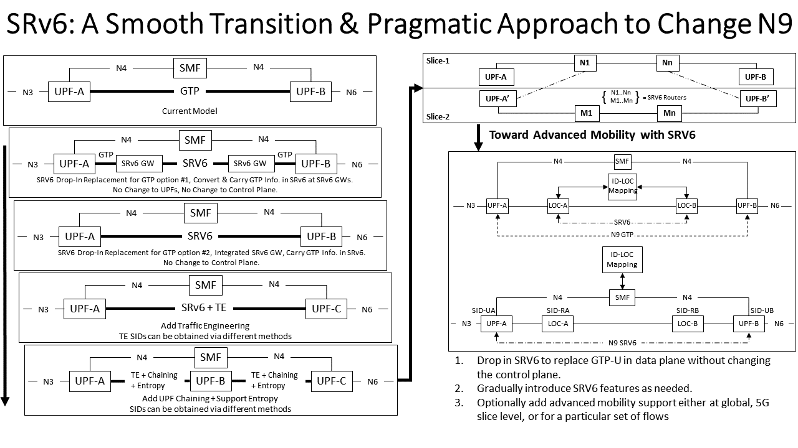

% Optimized Mobile User Plane Solutions for 5G
% draft-bogineni-dmm-optimized-mobile-user-plane-01.txt
% K. Bogineni, A. Akhavain, T. Herbert, D. Farinacci, A. Rodriguez-Natal, G. Carofiglio, J. Augé, L. Muscariello, P. Camarillo, S. Homma IETF 102 Montreal, 17th of July, 2018

## Background
- 3GPP CT4 has initiated a study item to study different mobility management protocols for potential replacement of GTP tunnels between UPFs (N9 Interface) in the 3GPP 5G system architecture of Release 16 (5G Phase 2)
- References
 3GPP TS 29.281 (V15.1.0): GPRS Tunnelling Protocol User Plane (GTPv1-U)
    - 3GPP TR 29.891 (V15.0.0): 5G System – Phase 1; CT4 Aspects
    - 3GPP TS 23.501 (V15.0.0): System Architecture for the 5G System
    - 3GPP TS 23.503 ( V15.0.0): Policy and Charging Control Framework for the 5G System, Stage 2
    - ETSI GR NGP 004 (V1.1.1): Next Generation Protocol (NGP): Evolved Architecture for mobility using Identity Oriented Networks
- Several protocol candidates in IETF: SRv6, LISP, ILA, Hybrid-ICN, etc
- Document prepared as submission to CT4 for consideration draft-bogineni-dmm-optimized-mobile-user-plane-01

## Overview of updates

- Overview of updates
   - Focus of 5G architecture only on mobility management parts
   - Roaming architectures: policy aspects; details on LBO and Home Routed
   - Support for different mobility protocols within same operator network using 5G network slices
   - Roaming architectures when operators use different mobility management protocols on N9
   - Data Plane architecture models for N9: Locator based; Locator-ID based; ID-based
   - Reviewed approaches: add tree in Section 5.2

## 3GPP Release 15 5G NGC Architecture

\tiny
__Non-Roaming Architecture: Reference Point Representation__

~~~
         +------+ +------+     +------+
         | NSSF | | AUSF +-N13-+ UDM  |
         +------+ +------+     +------+
               \      |      /      \
                N22  N12   N8        N10
                 \    |    /          \
                 +----+----+       +-------+      +------+      +------+
     +-----------+   AMF   +- N11 -+  SMF  +- N7 -+  PCF +- N5 -+  AF  |
     |           +++-----+++       +---+---+      +--+---+      +------+
     |            ||     ||            |             |
     |            ||     |+------------|----- N15 ---+
     N1         N2|+-N14-+            N4
     |            |                    |
  +--+--+        ++-------+        +---+---+        +------+
  |  UE +-- NR --+ (R)AN  +-- N3 --+  UPF  +-- N6 --+  DN  |
  +-----+        +--------+        ++-----++        +------+
                                    |     |
                                    +--N9-+
        5G System Architecture in Reference Point Representation

~~~

\tiny

__AUSF__: Authentication Server Function

__AMF__: Access and Mobility Management Function

__DN__: Data Network (e.g.operator services,
	Internet  access or 3rd party services)

__NEF__: Network Exposure Function

__NRF__: NF Repository Function

__NSSF__: Network Slice Selection Function

\tiny
__Non-Roaming Architecture: Services Based Interfaces__

~~~
    ----+-----+-----+----+----+---------+--------+-----+----+----
        |     |     |    |    |         |        |     |    |
    +---+---+ |  +--+--+ | +--+---+  +--+--+  +--+--+  |  +----+
    | NSSF  | |  | NRF | | | AUSF |  | UDM |  | NEF |  |  | AF |
    +-------+ |  +-----+ | +------+  +-----+  +-----+  |  +----+
          +---+----+  +--+--+            +-------------+--+
          |  AMF   |  | PCF |            |      SMF       |
          +---+--+-+  +-----+            +-+-----------+--+
             N1  |                         |           |
   +-------+  |  |                         N4          N4
   | 5G UE |--+  |                         |           |
   +---+---+     N2                  +-----+-+     +---+---+      +----+
       |         |      +----N3------+  UPF  +-N9--+  UPF  +--N6--+ DN |
       |         |      |            ++----+-+     +-------+      +----+
       |         |      |             |    |
       |     +---+------+-+           +-N9-+
       +-----|    gNB     |
             +------------+

                      5G Service Based Architecture

~~~
\tiny

__PCF__: Policy Control Function

__SMF__: Session Management Function

__UDM__: Unified Data Management

__UPF__: User Plane Function

__AF__: Application Function

__UE__: User Equipment

__RAN__: (Radio) Access Network

## Roaming Architectures
- Acronymns:
    - HPLMN: Home Public Land Mobile Network
    - VPLMN: Visited PLMN
- Definitions (3GPP TS 21.905)
    - Mobility: The ability for the user to communicate whilst moving independent of location.
    - Roaming: The ability for a user to function in a serving network different from the home network.
   The serving network could be a shared network operated by two or more network operator.
- Requirements:
    - Roaming Requirements: 3GPP TS 22.011 Section 2
    - Mobility Requirements: 3GPP TS 22.278 Section 7

\tiny

~~~

                                      VPLMN      |     HPLMN
            +-----+         +-------+            |        +-------+
            | AF  |----N5---| V-PCF |-----------N24-------| H-PCF |
            +-----+         +-------+            |        +-------+
                                |                |
                               N7                |
                                |                |
                             +--+--+             |
                             | SMF |             |
                             +--+--+             |
                                |                |
      +-------+                N4                |
      | 5G UE +                 |                |
      +---+---+           +-----+--+             |
          |               |        |             |
          |   +---+-+   +-+-+    +-+-+  +----+   |
          +---| gNB |---|UPF|-N9-|UPF|--| DN |   |
              +-----+   +-+-+    +---+  +----+   |

        Roaming 5G System Architecture - Local Breakout Scenario

~~~

\tiny

~~~

                                 VPLMN   |      HPLMN
                  --------------------  N32 ----------------------------
                     |                   |               |
                     |     +-------+     |     +-------+ |      +-----+
                     |     | V-PCF |--- N24 ---| H-PCF |---N5---| AF  |
                     |     +-------+     |     +-------+ |      +-----+
                     |                   |         |     |
                     |                   |        N7     |
                     |                   |         |     |
                     |      +--+--+      |      +--+--+  |
                     +------|V-SMF|      |      |H-SMF|--+
                            +--+--+      |      +--+--+
                               |         |         |
      +-------+                |         |         |
      | 5G UE |                |         |         |
      +---+---+               N4         |         N4
          |                    |         |         |
          |     +-+---+     +--+--+      |      +--+--+      +----+
          +-----| gNB |-----| UPF |-----N9------| UPF |------| DN |
                +-----+     +--+--+      |      +-----+      +----+

           Roaming 5G System Architecture - Home Routed Scenario

~~~

## Sample Configurations for Access to Two DNs

\tiny

~~~
                           Service Based Interfaces
       ---------+------------+------------------+----------------------
                             |                  |
                          +--+--+            +--+--+
                          | SMF |            | SMF |
                          +--+--+            +--+--+
                             |                  |
      +-------+             N4                 N4
      | 5G UE |              |                  |
      +---+---+           +--+--+    +----+     +-----------+
          |           +---| UPF |----| DN |     |           |
          |           |   +-----+    +----+     |           |
          |     +-+---+-+                    +--+--+     +--+--+  +----+
          +-----|  gNB  |--------------------| UPF |--N9-| UPF |--| DN |
                +-------+                    +-----+     +-----+  +----+

Non-roaming 5G System Architecture for multiple PDU Sessions Service Based Interface

~~~

\tiny

~~~
                           Service Based Interfaces
       ---------+-----------------------+-----------------------
                                        |
                                     +--+--+
                                     | SMF |
                                     +--+--+
                                        |
      +-------+                  +------+-------+
      | 5G UE |                  |              |
      +---+---+                  N4             N4
          |     +-+---+       +--+--+        +--+--+    +----+
          +-----| gNB |-------| UPF |----N9--| UPF |----| DN |
                +-----+       +--+--+        +-----+    +----+
                                 |
                              +--+--+
                              |  DN |
                              +-----+
~~~

## Requirements

- UPF Requirements: 3GPP TS 23.501 Section 6.2.3
- N9 Requirements: 3GPP TR 29.891 Section 5.1.1

## Reference Scenarios for Evaluation

- Non-Roaming Scenarios
    - UE- Internet Connectivity (mobility cases)
    - UE-UE IP Packet Flow (mobility cases)
    - UE – 2 DNs with multiple PDU sessions
    - UE – 2 DNs single PDU session
- Roaming Scenarios
    - Local Break out
    - Home routed

- UE mobility SSC Mode 1
   - Single UPF
   - Multiple UPF
- UE Mobility SSC Mode 2
   - Single UPF
   - Multiple UPF
- UE Mobility SSC Mode 3
   - Single UPF
   - Multiple UPF

- Support for independent slices using GTP and/or other protocol will be covered. Mobility Management will be within each slice.
- Support for one UE connected to multiple slices using different mobility protocols will be described.

- Impacts to N2, N3, N4, N6, gNB, AMF and SMF

## Reviewed Approaches for Mobility Management

The document discusses the ability to introduce several approaches for mobility management,
some able to provide anchor-less mobility management, useful in some of the mentioned use cases.

- Locator-based
    - Tunnelling
    - 3GPP / GTP-U
    - Packet steering
    - SRv6 (backward-compatible)
- Loc/ID split
    - Packet steering
        - SRv6
    - Encapsulation
        - LISP
    - Address rewrite
        - ILA
- ID-based
    - Hybrid-ICN

## Segment Routing v6

## LISP – Locator Identifier Separation Protocol

- LISP Control-Plane (RFC6833bis)
    - Supports many data planes: ILA, SRv6, VXLAN, LISP, GTP, …
    - Mature mapping control-plane (10+ years) with large deployments
    - Mobility related drafts:
        - draft-ietf-lisp-eid-anonymity
        - draft-ietf-lisp-eid-mobility
        - draft-ietf-lisp-mn
        - draft-ietf-lisp-predictive-rlocs
        - draft-farinacci-lisp-mobile-network
- LISP Data-Plane (RFC6830bis)
    - Uses dynamic tunnel encapsulation
    - Fixed headers (16 bytes) are used between outer and inner IP headers
- LISP Control-Plane for ILA
    - draft-rodrigueznatal-ila-lisp
- LISP Control-Plane for SRv6
    - draft-rodrigueznatal-lisp-srv6

\tiny
~~~
                                 +----+----+
         +-------------N4--------+   SMF   +--------N4-----------+
         |                       +----+----+                     |
         |                            |                          |
         |                       +----+----+                     |
         |                       | ID-LOC  |                     |
         |                       | Mapping |      ID-LOC         |
         |  +------------------->| System  |<--control-plane--+  |
         |  |                    +----+----+                  |  |
         |  V                                                 V  |
     +---+---+                                               +---+---+
--N3-+ UPF-A +<---------- N9 - ID-LOC data-plane ----------->+ UPF-B +-N6--
     +-------+                                               +-------+

                                 +----+----+
         +-------------N4--------+   SMF   +--------N4-----------+
         |                       +----+----+                     |
         |                            |                          |
         |                       +----+----+                     |
         |                       | ID-LOC  |                     |
         |                       | Mapping |      ID-LOC         |
         |               +------>| System  |<--control-plane     |
         |               |       +----+----+     |               |
         |               V                       V               |
     +---+---+      +----+----+             +----+----+      +---+---+
--N3-+ UPF-A +--N9--+ID-L Node+<--ID-LOC--->+ID-L Node+--N9--+ UPF-B +-N6--
     +-------+  GTP +----+----+ data-plane  +----+----+  GTP +-------+
~~~

## ILA – Identifier Locator Addressing

- Identifier Locator Addressing: Problem areas, Motivation, and Use Cases:  draft-herbert-ila-motivation-00
- Identifier-locator addressing for IPv6: draft-herbert-intarea-ila-00
- Identifier Locator Addressing Mapping Protocol: draft-herbert-ila-ilamp-00
- Identifier Locator Addressing for Mobile User-Plane: draft-herbert-ila-mobile-00
- Identifier groups: draft-herbert-idgroups-00
- Mobility Management Using Identifier Locator Addressing: draft-mueller-ila-mobility-02
- Use of BGP for dissemination of ILA mapping information: draft-lapukhov-bgp-ila-afi-02

## ID-native > Hybrid-ICN Anchorless Mobility Management (hICN-AMM)

\textcolor{ProcessBlue}{Hybrid ICN mobility management overview}

\vspace{2mm}

- Routable, location-independent identifiers (ID)
  \textcolor{Gray}{[draft-vonhugo-5gangip-ip-issues-03]}

    - NO address overloading, NO data plane anchor
    - NO mapping system, NO control plane anchor

\vspace{2mm}

- Hybrid-ICN: an ICN communication model within IPv6

  \textcolor{Gray}{[draft-muscariello-intarea-hicn]}

    - native consumer mobility; lightweight FIB update for producer
    - ICN benefits for mobility \textcolor{Gray}{[RFC7476]} including:
        - multi-source/multi-path/hetnet support
        - fine-grained forwarding and security policies
        - low-latency, multicast (in-path caching)
        - network-assisted transport

\vspace{2mm}

- MAP-Me : a pure-ID mobility management scheme
  \textcolor{Gray}{[draft-irtf-icnrg-mapme]}

    - ensuring connectivity through __data plane__ mechanisms
    - using data plane messages
      \textcolor{Gray}{[Lui et al, NSDI'13]}

\vspace{2mm}

\textcolor{ProcessBlue}{Drafts}

\vspace{2mm}

\small

~~~
draft-auge-dmm-hicn-mobility-00
draft-auge-dmm-hicn-deployment-options-00
~~~

\textcolor{ProcessBlue}{GTP replacement on N9 (N9+N3)}

\vspace{2mm}

\nopandoc{\begin{center}}

\Tiny

~~~
       UE            5G-AN        N3         UPF        N9   UPF    N6
       |                          |                     |            |
   +--------+                     |                     |            |
   |  App.  |--------------------------------------------------------|
   +--------+                     |                     | +--------+ |
   | IP PDU |                     |                     | | IP PDU | |
   | (hICN) |---------------------------------------------| (hICN) | |
   +--------+ +-----------------+ | +-----------------+ | |        | |
   |        | |\     relay     /| | |\     decap     /  | |        | |
   |        | | \_____________/ |-|-| \_____________/   | |        | |
   |        | |        | GTP-U  | | | GTP-U  |          | |        | |
   |        | |        +--------+ | +--------+          | |        | |
   |   5G   | |   5G   |  UDP   |-|-|  UDP   |          | |        | |
   |   AN   |-|   AN   +--------+ | +--------+          | |        | |
   |protocol| |protocol|   IP   |-|-|   IP   |          | |        | |
   | layers | | layers +--------+ | +--------+--------+ | +--------+ |
   |        | |        |   L2   |-|-|   L2   |   L2   |-|-|   L2   | |
   |        | |        +--------+ | +--------+--------+ | +--------+ |
   |        | |        |   L1   |-|-|   L1   |   L1   |-|-|   L1   | |
   +--------+ +-----------------+ | +-----------------+ | +--------+ |
                                  |                     |            |
~~~

\nopandoc{\end{center}}

\textcolor{ProcessBlue}{Deployment options}

\vspace{2mm}

- Partial deployment on few selected nodes
    - transparent for IPv6 nodes
    - eventually exploiting SRv6 DP in between

\vspace{1mm}

- full-benefits with hICN on endpoints, or proxy
    
\vspace{1mm}

- benefits of ID-native by replacing N9 (+N3)
    - even for non-hICN traffic

\vspace{1mm}

- alternative hICN insertion in MEC/UPF
    - transport benefits

## Network Slicing in 5G
The ability to support several mobility management protocols to fit different use cases
using 5G slicing.

\tiny

~~~
Locator-based                   ID-LOC split              ID-based
(GTP, SRv6-T)             (LISP, ILSR, ILA, SRv6-E)        (hICN)
 ----+-------------------------------+-----------------------+----------
     |                               |                       |
+---------------------+ +-----------------------+ +--------------------+
| +-------+  Slice #1 | | +----------+ Slice #2 | | +-------+ Slice #4 |
| | SMF   |---+   GTP | | | Mapping  +---+      | | | SMF   |---+ hICN |
| +--+----+   |       | | +---+-----++   |      | | +--+----+   |  AMM |
| N4 |        | N4    | |     |     |    |      | | N4 |        | N4   |
| +--+--+  +--+----+  | | +---+---+ | +--+----+ | | +--+--+  +--+----+ |
| | UPF |  | UPF   |  | | | LOC-A | | | LOC-B | | | | UPF |  | UPF   | |
| +-----+  +-------+  | | +-------+ | +-------+ | | +-----+  +-------+ |
+----------- ---------+ +-----------|-----------+ +--------------------+
                  |                 |       |           |          |
               +--+-+               |    +--+-+      +--+--+    +--+-+
               | DN |               |    | DN |      | MEC |    | DN |
               +----+               |    +----+      +-----+    +----+
                       +------------|------------+
                       |            |   Slice #3 |
                       |     +------+---+        |
                       |     |          |        |
                       | +---+---+    +-+-----+  |   +----+
              +-----+  | | LOC-A |    | LOC-B |  |---| DN |
              | MEC |--| +-------+    +-------+  |   +----+
              +-----+  +-------------------------+

                          Network slices in 5G

~~~

## Next Steps
- Feedback from 3GPP CT4

{ .class height=120% width=80%}
